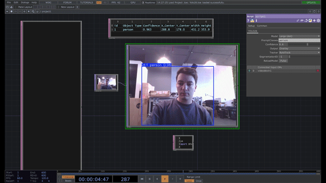
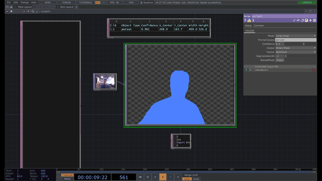
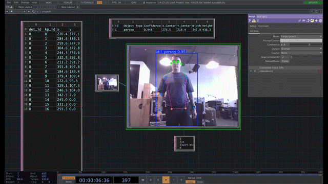

# TouchDesigner + YOLO26 (Script TOP)

Python Script TOP for TouchDesigner that runs YOLO v2.6 models (detection, segmentation, pose) with prompt filtering, native YOLO overlay or mask output, and optional tracking (ByteTrack / BoT-SORT) for stable IDs and colors.  
  

## Features
- Preset model menu (det / seg / pose variants of YOLO26).
- Prompt-based class filtering (names or numeric IDs).
- Output modes: YOLO native overlay or mask.
- SegmentationID selector:
  - `-2` → all masks, each colored by track ID (stable across frames).
  - `-1` → combined binary mask.
  - `>=0` → only the mask whose track ID matches the value.
- Optional tracking: ByteTrack or BoT-SORT (keeps IDs/colors stable). Falls back to no tracking if tracker deps are missing.
- Per-frame data export to DATs: bounding boxes (`detections` DAT) and pose keypoints (`pose_points` DAT, when using pose models).
- Model cache and Reload pulse to avoid repeated loads.

## Requirements
- TouchDesigner 2023+ with embedded **Python 3.11**.
- Python packages (see `requirements.txt`):
  - `ultralytics`
  - `opencv-python`
  - `numpy`
  - `lapx` (needed for ByteTrack / BoT-SORT tracking)

## Installation
1. Install NVIDIA CUDA (driver/toolkit) first.  
2. Run the provided installer batch to use TouchDesigner’s Python and install CUDA-enabled PyTorch plus all requirements:
```powershell
install_td.bat
```
If `lapx` fails to build and you don’t need tracking, you can omit it (overlay/mask still work).

## Setup in TouchDesigner
1) Place `td_yolo26.py` as a Text DAT in your project.  
2) Add a **Script TOP** and set its `DAT` parameter to that DAT.  
3) Click **Setup Parameters** on the Script TOP to create custom parameters.  
4) Connect a video/image TOP to the Script TOP input.  
5) (Optional) Create two DATs named `detections` and `pose_points` if you want tabular outputs.

## Parameters (Script TOP)
- `Model` — choose a YOLO26 weight (det/seg/pose variants bundled in the repo).  
- `CustomPath` — path to a custom `.pt` model (only used when `Model` = `custom`).  
- `PromptClasses` — comma/semicolon list of class names or IDs to keep.
- `Confidence` — detection confidence threshold.
- `Output` — `overlay` (YOLO native draw) or `mask`.
- `SegmentationID` — mask selection (`-2` all colored, `-1` combined, specific ID).
- `Tracker` — `None`, `ByteTrack`, or `BoT-SORT` (needs `lapx`).
- `ReloadModel` — pulse to clear the model cache (use after changing weights on disk).

## Outputs
- Script TOP output: RGBA uint8 at the input resolution.
  - Overlay mode: YOLO native annotations.
  - Mask mode: according to `SegmentationID` rules above.
- DATs (if present):
  - `detections`: columns `id, Object Type, Confidence, X_Center, Y_Center, Width, Height` (IDs are tracker-stable when tracking is on).
  - `pose_points`: columns `det_id, kp_id, x, y` (for pose models).

## Notes
- Use `*-seg.pt` models for masks; `*-pose.pt` for keypoints.  
- If tracking reports a missing `lap` module, either install `lapx` or set `Tracker` to `None`.  
- Masks and IDs remain stable across frames when tracking is enabled.

## Troubleshooting
- No output: ensure an input TOP is connected and the selected model matches the task (e.g., seg model for masks).
- Missing Python modules: rerun the pip install command with TD’s Python.
- Tracking slowdown or errors: switch `Tracker` to `None` if `lapx` is unavailable or performance is critical.
- Installing requirements with system Python 3.11:  
  ```powershell
  py -3.11 -m pip install -r requirements.txt --prefer-binary
  ```
